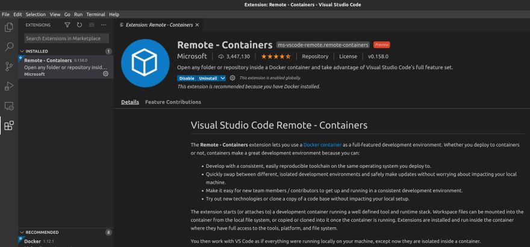
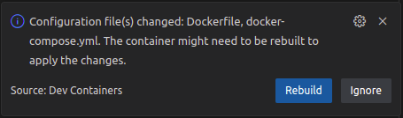

# 📚 Deploily Documentation

## Prerequisite 

* Visual Studio code [https://code.visualstudio.com/](https://code.visualstudio.com/)
* A working installations of Docker and Docker compose
    - [https://docs.docker.com/engine/install/](https://docs.docker.com/engine/install/)

## Clone the repo

```sh
git clone https://github.com/deploily/deploily-documentation.git
cd deploily-documentation
```

## Project setup using VSCode

Start VSCode 
```bash
code .
```

In the Extensions menu, search for "Remote - Containers" and install it:



If VSCode dont detect the remote container: 
- open the Command Palette (usually Ctrl or Command + Shift + P) 
- and type ">Remote-Containers: Open Folder in Container", 
- select it and choose the location of this project.

If you are prompted to Rebuild the container do it: 



If the **Rebuild** prompt don't shows up : 
- open the Command Palette (usually Ctrl or Command + Shift + P) 
- and type ">Remote-Containers: Rebuild Container", 
- select it.


## 🛠️ Development

```bash
cd documentation
npm install
npm run start
```

## Build

```bash
npm run build
npm run serve
```

## Useful links

- [https://squidfunk.github.io/mkdocs-material/getting-started/](https://squidfunk.github.io/mkdocs-material/getting-started/)


