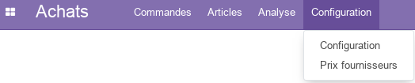
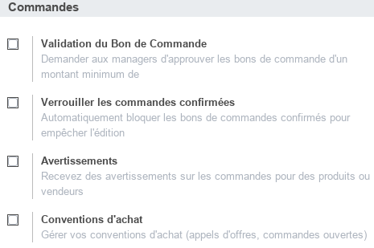
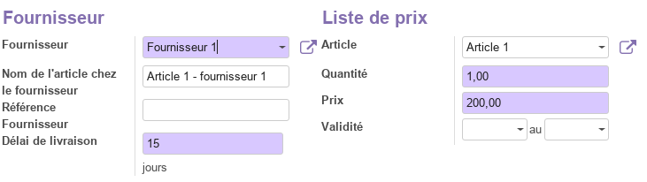
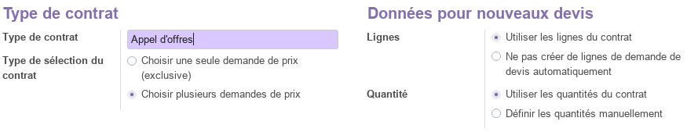
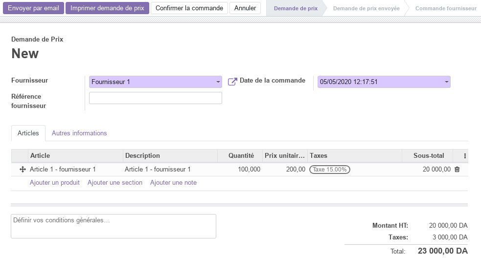
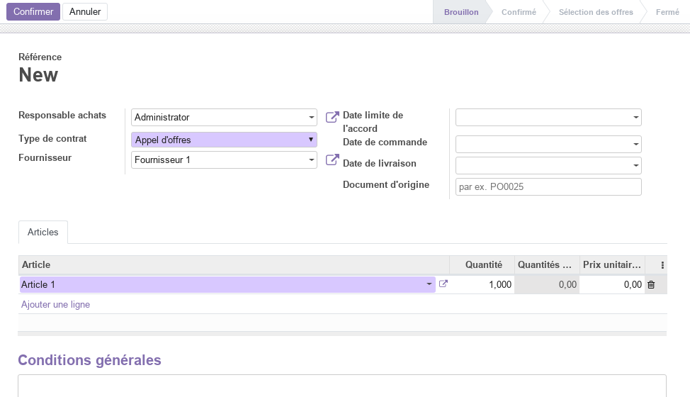
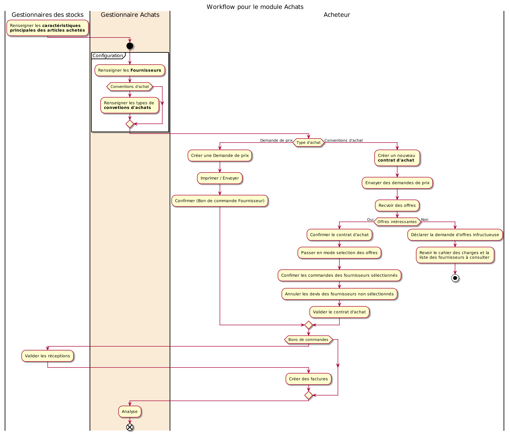

<h1 style={{ fontSize: '20px', fontWeight: 'bold'}}>Module Achats</h1>

Ce document illustre les différentes fonctionnalités du module **Achats** d'odoo 13 community.

## Présentation du module

Ce module est destiné à la gestion des fournisseurs et des commandes d'achat. Il permet :

- d'automatisez le processus d'achat, d'envoyez automatiquement des demandes de prix aux fournisseurs
en fonction des besoins de l'inventaire.
- de définir des règles d’approvisionnement, de logistiques, de commandes de vente à l’aide de prévisions de commandes de fabrication, tout cela en fonction des besoins du stock.
- de sélectionnez différentes méthodes d’approvisionnement pour chacun des produits en cohérence avec les stratégies de fabrication et de livraison de l'entreprise.
- de listez les prix des fournisseurs et de vérifiez la disponibilité des produits tout en comparant les meilleurs prix.
- d'importer facilement les listes de prix et les références des fournisseurs afin de prendre les meilleures décisions concernant les achats selon les promotions et conditions spéciales en vigueur.
- de lancer des appels d’offres, afin d'obtenir le meilleur prix en négociant avec plusieurs fournisseurs.
- de lancez les procédures d'acquisition, d'intégrer les réponses des sous-traitants et de comparez les devis afin de choisir la meilleure offre.
- d'obtenir des statistiques sur les achats afin d'analyser, de prévoir et de planifiez efficacement les commandes.
- de gérer plusieurs entreprises grâce aux règles inter-entreprises.

## Configuration (admin)

Cette section, réservée aux **administrateurs** et **Gestionnaires des achats**, permet de définir les paramètres généraux du module.

#### Configuration des Commandes

- L'option **_Validation du Bon de Commande_** permet de fixer un montant minimal au dela duquel une approbation du manager est requise.
- L'option **_Verrouiller les commandes confirmées_** permet de bloquer automatiquement les bons de commandes confirmés pour empêcher l'édition.
- L'option **_Avertissements_** permet aux **Responsables des achats** de recevoir des alerts particulières pour des produits ou des acheteurs.
- L'option **_Conventions d'achat_** permet aux **Responsables des achats** de gérer les contrats d'achats (appels d'offres, commandes ouvertes, ...).

#### Configuration des Articles

- L'option **_Grille d'entrée des variantes_** permet d'ajouter plusieurs variantes sur le bon de commande depuis une grille (matrice).

### Prix fournisseurs

Cette section permet de définir les prix des articles chez les fournisseurs. Ainsi, le **Gestionnaire des achats** peut affecter plusieurs prix d'achats au même article afin de les comparer.

### Type de conventions d'achat

Ce paramétrage est disponible lorsque l'option **_Conventions d'achat_** est activée dans la configuration du module.

Cela permet aux **Gestionnaires des achats** de définir les différents types de conventions d'achat à utiliser, tel que : des appels d'offres, des commandes à livraison échelonée, ...

## Commandes

Cette partie permet de gérer les Devis et les Commandes.

### Demandes de prix

Cette section permet de gérér les Demandes de prix (Devis) des fournisseurs en renseigants toutes les informations nécessaires tel que le fournisseurs, la date, les conditions de paiement, les termes et les **articles** demandés.

Cette demande de prix, imprimable avec la commande **_Imprimer/Demande de prix**, progresse par plusieurs état qui sont : **_Demande de prix_**, **_Demande de prix envoyée_** et **_Commande fournisseur_**. Le Demande de prix peuvent aussi être envoyé directement par email. La commande **_Confirmer la commande_** permet de promouvoir la **Demande de prix** en **Commande fournisseur**.

### Bons de commande

Cette section permet de gérer les **bons de commandes fournisseurs** ayant été promus à partir d'une **demande de prix**.

### Conventions d'achat

Lorsque l'option **_Conventions d'achat_** est activée dans la configuration du module, de nouvelles fonctionnalités sont disponibles permettant de gérer les contrats d'achat.

Ce **Contrat d'achat**, progresse par plusieurs état qui sont : **_Brouillon_**, **_confirmé_**, **_Selection des offres_** et **_Fermé_**. 

La commande **_Confirmer_** permet de promouvoir le **Contrat** en **Confirmé**. A ce stade, le **Gestionnaire des achats** peut envoyer des **Demandes de prix** et recevoir des offres (consultation) ou attendre l'échance du délais d'appel d'offres par exemple pour ensuite **_Confirmer_** le Contrat qui passe en phase de **_Selection des offres_**. A l'issue de la sélection et en fonction du type de contrat souhaitéc le **Gestionnaire des stocks** confirmera les commandes chez les fournisseurs retenus.

### Fournisseurs

Cette section permet de gérer les fournisseurs de l'entreprise.

## Articles

Cette section permet de consulter les articles gérés par l'entreprise et **pouvant être achetés**. Pour plus d'informations, consulter le module [Stock / Article](./odoo-stock.mdx#articles).

## Analyse

La partie analyse permet aux **Gestionnaires des achats** de visualiser des vues synthétiques de la situation des achats sous différentes formes : tableau croisé, graphes.

## Workflow

## Plus de détails

- Pour la collaboration sur les formulaires de ce module, consulter la fonctionnalité [conversations](./odoo-conversations.mdx).
- [Site officiel d'odoo](https://www.odoo.com/fr_FR/page/purchase).

----
🔗 **Official Resource**: [Odoo Documentation](https://www.odoo.com/documentation)

