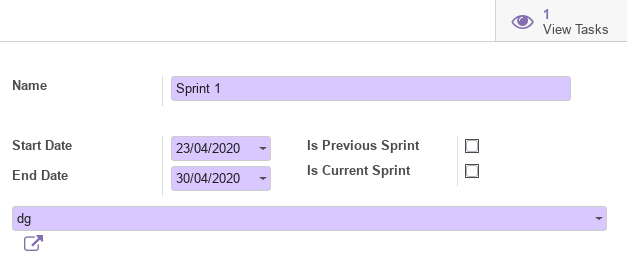
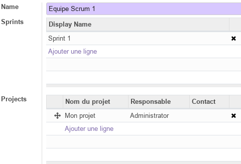
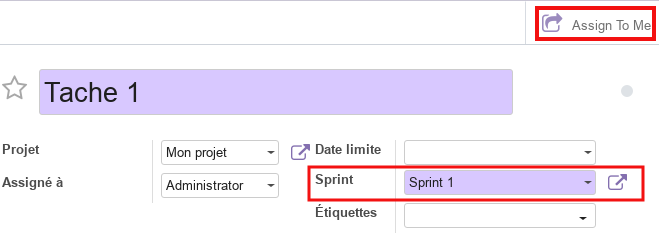

<h1 style={{ fontSize: '20px', fontWeight: 'bold'}}>Module Projet Scrum</h1>

Ce document illustre les différentes fonctionnalités du module additionnel **Projet Scrum** d'odoo 13 community. 

## Présentation du module 

Ce module additionnel au [Module Projet](./odoo-project.mdx), est destiné à la gestion de projet agiles avec la méthode **Scrum**. Il permet :
- de gérer les Sprints et d'associer des équipes scrum à des projets.
- d'associer les taches à des Sprints afin de faciliter leur suivi.

## Configuration (admin)

### Sprints 

Cette section permet de prédéfinir les informations essentielles des **Sprints** dans les quelles s'exécutes les taches en cours.

### Scrum Teams

Cette section permet de prédéfinir les informations essentielles relatives aux **Equipes Scrum** impliquées dans la réalisation des taches du projet.

## Tâches 

Ce module ajoute de nouvelles fonctionnalités au module projet, notamment aux **Tâches**, qui dipose ainsi de nouveau paramètres permettant de les liées aux **Sprints**.

## Plus de détails 

- [Lien de téléchargement du module](https://github.com/enlight-me/odoo-addons).  

----
🔗 **Official Resource**: [Odoo Documentation](https://www.odoo.com/documentation)

