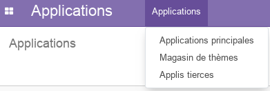
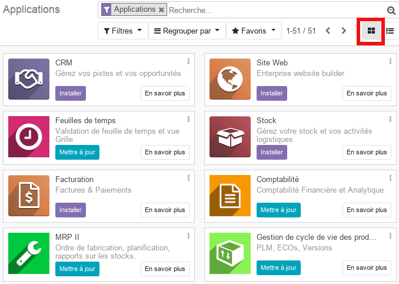
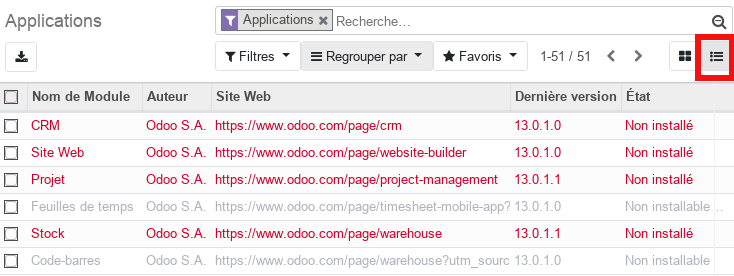
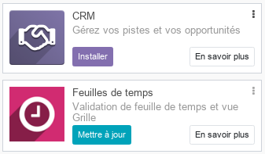
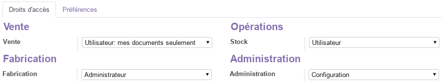

<h1 style={{ fontSize: '20px', fontWeight: 'bold'}}>Vue d'ensemble des Applications (admin)</h1>

Cette partie, **réservée aux adminstrateurs**, permet d'installer, de désinstaller et de mettre à jours les modules disponibles sur la platform odoo.

## Applications principales

Cette vue en **kanban** donne accès à tous les modules disponibles pouvant être installés, et qui couvrent les différentes fonctions d'une entreprise, CRM, Stocks, Ventes, Achats, Ressources Humaines, ...

Le mode **kanban** peut être rempplcé par le mode **liste** afin de visualiser plus de détails.

Sur chaque carte, représentant un module, on peut lire le **nom** et la **description**. Le boutton **_Installer_** permet d'installer le module et les modules avec un boutton **_Mettre à jour_** sont des modules de l'édition Entreprise (payant).

## Magasin de thèmes & Applis tierces

Ces menus donnent accès à des modules et des thèmes supplémentaires disponibles en lignes. Ces extensions ne sont pas toutes gratuites.

## Applications et droits utilisateurs

A chaque fois qu'une nouvelle Application est installée sur odoo, on constate que des paramètres supplémentaires sont ajoutés à la section **Droits d'accès** des [utilisateurs](./odoo-configuration.mdx#utilisateurs). En effet, chaque application odoo (module) nécessite un paramétrage spécifique des droits d'accès afin de gérer correctement les autorisations accordées aux utilisateurs (création, lecture, écriture, suppression) très importantes pour les workflows métier (validation, impression, envoi par mail).

De manière générale, odoo classe les droits d'accès utilisateurs pour chaque module en trois familles :

1. **_Utilisateur_** : droits d'accès **basics**, destiné généralement aux **collaborateurs**.
1. **_Admnistrateur_** : droits d'accès **avancés**, destiné généralement aux **Responsables métiers** qui ont une vision globale des activités et qui valident les actions des collaborateurs.
1. **_Configuration_** : droits d'accès **avancés techniques**, destiné généralement aux **administrateurs** qui doivent collaborer avec les **Responsables métiers** afin de personnaliser correctement les modules aux spécificités de l'entreprise.  

----
🔗 **Official Resource**: [Odoo Documentation](https://www.odoo.com/documentation)

