<h1 style={{ fontSize: '20px', fontWeight: 'bold'}}>Vue d'ensemble de la configuration (admin)</h1>

Cette partie, **réservée aux adminstrateurs**, permet de définir les paramètres communs les plus importants pour la personnalisation de la platform  odoo aux besoins de l'entreprise.

**Important** : de nouveaux menus/options peuvent apparaitres dans cette partie lorsque des modules sont installés. 

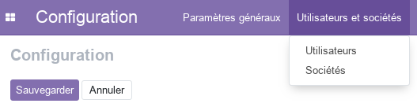

## Utilisateurs
La partie utilisateurs permet de gérer les utilisateurs (ajout / supression / modification / archivage).

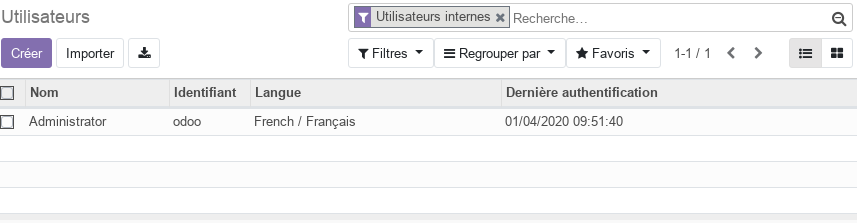

Pour créer un nouvel utilisateur, cliquer sur **_Créer_**. 

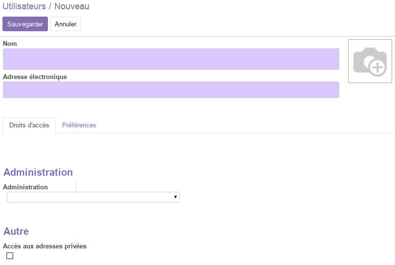

Ainsi, vous pouver renseigner toutes les informations utiles.
- Nom, photo, email
- Droits d'accès aux modules installés
- Préférences (langue, signature, fuseau horaire)

Pour confirmer cliquer sur **_Sauvegarder_**. Le nouveau utilisateur est ajouté à la liste.

Pour modifier le mot de passe de l'utilisateur, séléctionner le dans la liste et chosir le menu **_Action / modifier le mot de passe_**.

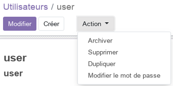

Le nouveau utilisateur peut maintenant se connecter et mettre à jour son profil dans [Préférences d'utilisateur](./odoo-user-preferences.mdx).

## Sociétés
La partie sociétés permet de gérer les sociétés (ajout / supression / modification / archivage). Une société est une entité juridique autonome qui dispose de ses propres personnels, finances, ventes, ... 

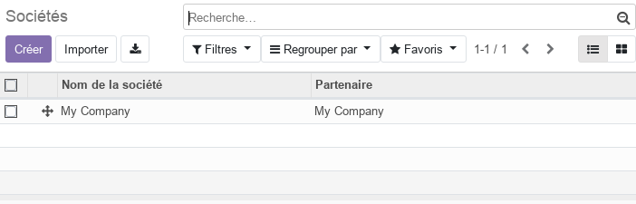

Pour créer un modifier les informations de la société, séléctionner-la dans la liste et cliquer sur **_Modifier_**. 

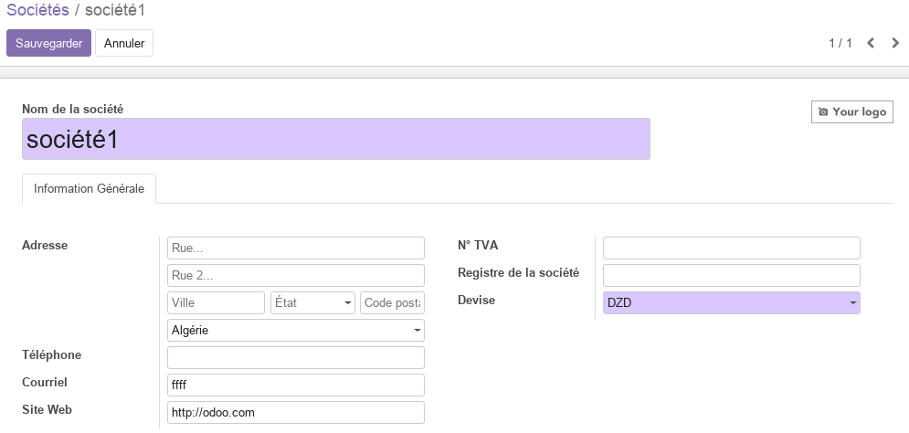

Ainsi, vous pouver renseigner toutes les informations utiles de votre société et qui apparaitrons sur les entêtes et pieds de pages rapports (documents) imprimés. 

Pour avoir un aperçu des rapports, utiliser le menu **_Imprimer / Aperçu de rapprt externe_**.

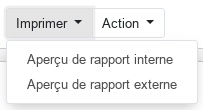

## Paramètres généraux 

Le pannaux **Paramètres généraux** permet de définir les paramtètres essentiels utilisés par tous les modules d'ooo. Il donne un accès global aux paramètres : Utilisateurs, Sociétés, Langues, Documents commerciaux, Contacts, Intergrations, ...

### Documents commerciaux 
Ces paramètres sont essentiels pour la personnalisation d'odoo aux besoins de l'entreprise. 

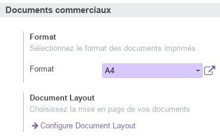

- **Format** permet de définir la taille, les marges, l'orientation et la résolution de la feuille utilisée lors de l'impression.
- **Document Layout** permet de définir l'agencement, le logo, les couleurs, la fonte, le slogan de la société et le bas de page. Un aperçu dynamique et disponible pour visuliser les modifications.

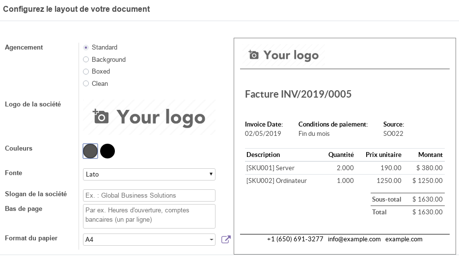

Pour avoir un aperçu des rapports, utiliser le menu **_Imprimer / Aperçu de rapprt externe_**, dans la page relative à la [société](#sociétés).

### Messages

La section **Messages** permet de définir les paramètres realtifs aux types d'activités et au serveur de messagerie externe.

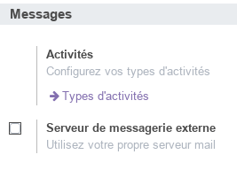

Dans la section types d'activités, l'administrateur peut définir des activités standardisées qui seront utilisées dans d'autres modules (Employés, Notes, Ventes,...).  

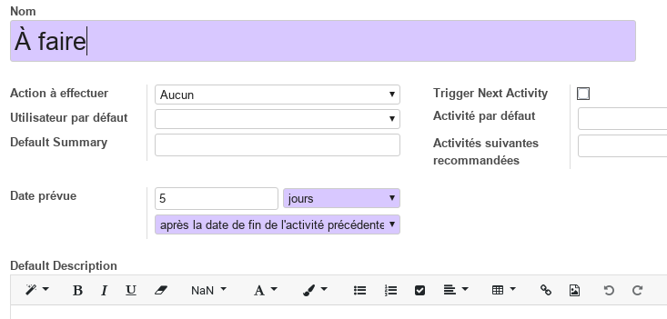

----
🔗 **Official Resource**: [Odoo Documentation](https://www.odoo.com/documentation)

