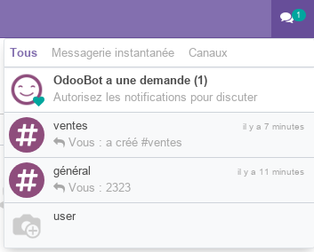
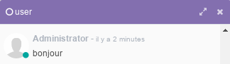

<h1 style={{ fontSize: '20px', fontWeight: 'bold'}}>Conversations</h1>

## Icone de notification

En haut à droite vous aver un icone de notifications qui vous indique le nombre de messages non lus. Ainsi, vous pouver directement les consulter et envoyer des réponses ou de nouveau messages.  

**Important** : odoo peut être configuré pour envoyer des notifications ditectement sur le bureau du système d'exploitation. Ceci doit être autorisé dans les paramètres de notifications du navigateur utilisé.

## Chat instantané 
Dans chaque module odoo vous pouver lancer une conversations en utilisant **_Nouveau Message_** à partir de l'icone **Notifications**.

Une fenetre popup apparait dans lequelle vous pouver discuter directement avec votre interlocuteur.

## Bas de formulaires

Dans quasiement tous les modules d'odoo, vous constater en bas des formulaires une zone de conversations spécifique qui permet d'échanger sur l'enregistrement en cours (employé, facture, devis, article,...).

**To be continued**...

## Plus de détails 

- [Discuss sur odoo eLearning](https://www.youtube.com/watch?v=EMAWvsyu3cI&list=PL1-aSABtP6AD-t0GEoxMXgCa_qLsHs5PR&index=4)

----
🔗 **Official Resource**: [Odoo Documentation](https://www.odoo.com/documentation)

