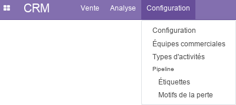
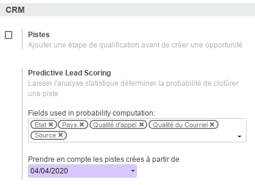
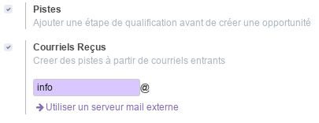
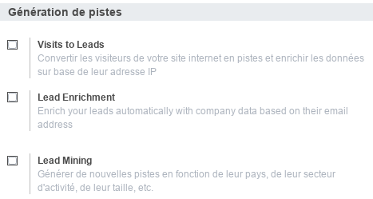
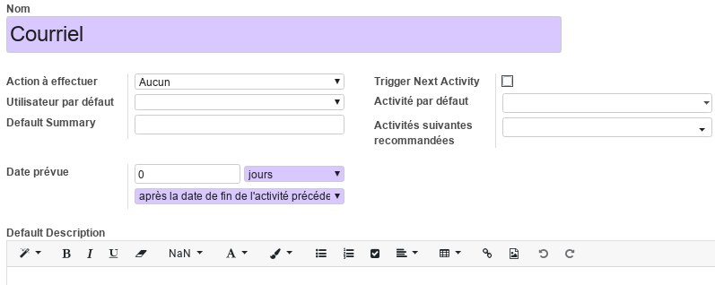
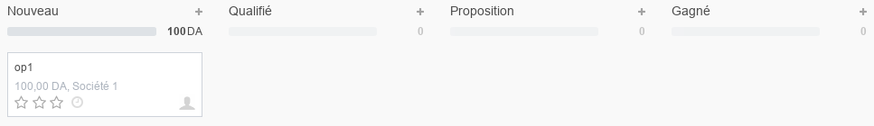
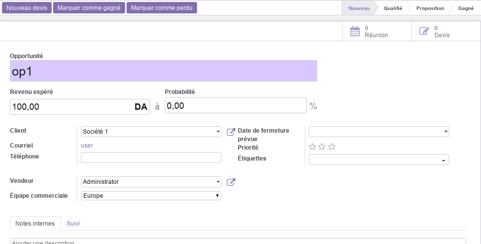
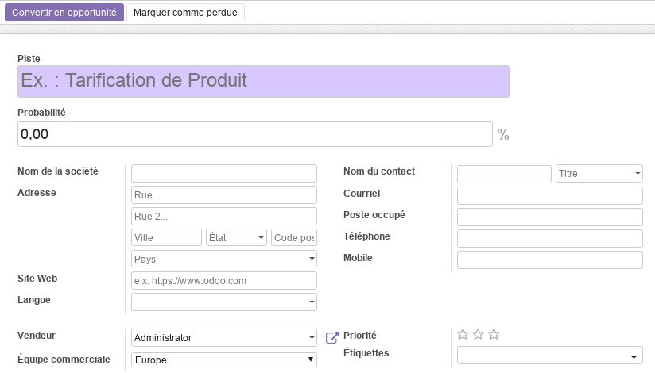
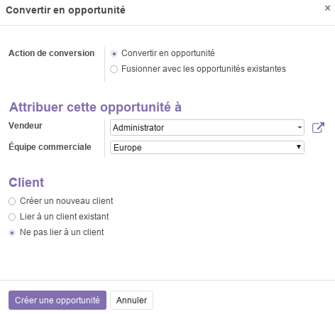
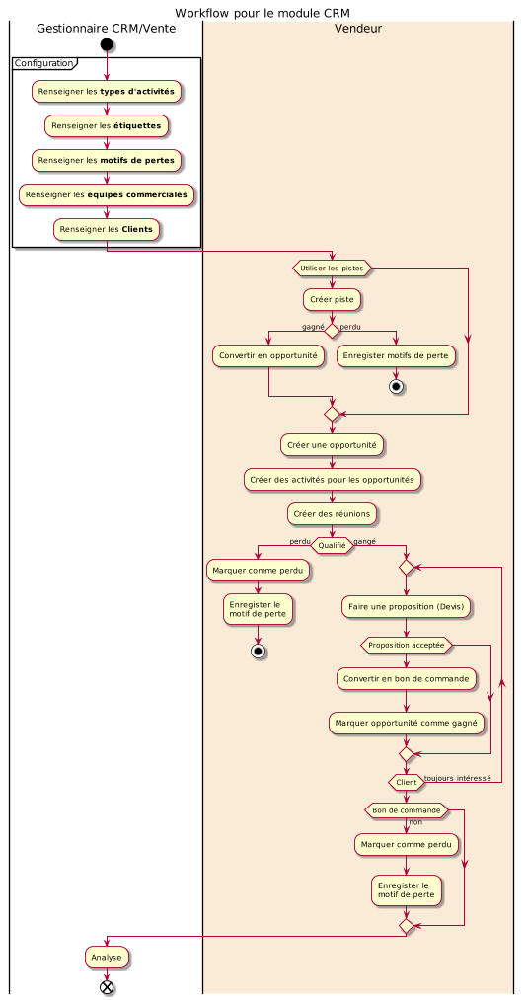

<h1 style={{ fontSize: '20px', fontWeight: 'bold'}}>Module CRM</h1>

Ce document illustre les différentes fonctionnalités du module **CRM** d'odoo 13 community (CRM : Customer Relationship Management / Gestion de la Relation Client).

## Présentation du module

Ce module, orienté client par excellence, est destiné au suivi des pistes et à l'élaboration des prévisions de vente. Il permet :
- d'utilisez des données concrètes afin de prendre les meilleures décisions.
- d'utiliser des tableaux de bords personnalisés afin d’avoir un aperçu rapide de l'entreprise.
- de planifier des activités en fonction des scripts de vente: appels, réunions, mailing et devis.
- de passer facilement en revue les performances et les prochaines activités.
- de suivez les performances en temps réel et de les comparez aux objectifs mensuels.
- d'organiser le travail sur la base des prochaines actions planifiées.

## Configuration (admin)

Cette section, réservée aux **administrateurs** et **Gestionnaires des ventes**, permet de définir les paramètres généraux du module, tel que l'ajout d'une étape de qualification avant création d'une opportunité et la génération des pistes.

#### Pistes

L'option **_Pistes_**  active de nouvelles fonctionnalités permettant aux **Vendeurs** de disposer d'une partie dédiée à la gestion des pistes.

Si cette option est activé, un nouveau menu **_Pistes_** apparait, et le **Gestionnaire des vente** peut choisir d'utiliser les courriels entrants pour la génération des pistes.

#### Generation pistes

- L'option **_Visits to Leads_** permet de convertir les visiteur du site web en pistes (lead) à partir de leur adresse IP (**option payante**).
- L'option **_Lead Enrichment_** permet de créer des pistes à partir des données des sociétés en se basant sur les adresses emails (**option payante**).
- L'option **_Lead Enrichment_** permet de générer de nouvelles pistes en fonction des pays, secteurs d'activité, taille d'entreprise, ... (**option payante**).

### Équipes commerciales

Cette section permet de renseigner les informations nécessaires aux équipes commerciales de l'entreprise. Pour plus de détails, consulter le module [Vente](./odoo-vente.mdx).

### Types d'activités

Cette section permet de prédéfinir l'ensemble des activités liées à la relation client, tel que les appels téléphoniques, l'envoi d'emails, les rendez-vous, ...

Pour chaque activité, les paramètres suivants sont prédéfinis.

### Pipeline - Étiquettes

Cette section permet de prédéfinir des étiquettes a associé aux opportunités, tel que les types de produits et services (formation, conseil, ...).

### Pipeline - Motifs de la perte

Cette section permet de prédéfinir des motifs de pertes d'une opportunité ou d'une piste. Exemple : trop chère, pas de compétence, pas assez de stock, ...

## Vente

### Mon Pipeline

Le pipline est l'outil le plus important dans le CRM. Il permet de définir et de suivre l'évolution des opportunités selon plusieurs étapes prédéfinies : **_Nouveau_**, **_Qualifié_**, **_Proposition_**, **_Gagné_**.

On commence par créer une opportunité en renseignant ses informations.

L'opportunité peut donner lieu à un ou plusieurs **Devis** et peut être marqué comme gangé ou perdu.

Le vendeur peut créer et suivre les **Réunions** relative à l'opprtunité directement à partir de son formulaire de définition.

### Devis

Cette section permet de gérer tous les devis crées par les vendeurs de l'entreprise, notamment ceux générés à partir des opportunités. Pour plus de détails, consulter le module [Vente](./odoo-vente.mdx).

### Pipelines des équipes

Cette section offre une tableau de bord synthétique des ventes effectuées pour chaque équipe commerciale, le même que celui du module [Vente](./odoo-vente.mdx).

### Clients

Cette section liste l'ensemble des clients ciblés par l'entreprise. Similaire à celle du module [Vente](./odoo-vente.mdx).

## Pistes

Si l'option pistes est activé dans la configuration du module, le **Responsable des ventes** peut créer de nouvelles pistes manuellement afin que les vendeurs les qualifies par la suite.  

Si une piste est probante, elle peut **_Convertie en opportunité_** et le vendeur aura la main pour ajouter un nouveau client avec les informations du contact saisies ou de fusionner avec un client/une opportunité existante.

Sinon, la piste peut être **_Marqué comme perdue_**.

## Analyse

La partie analyse permet aux **Gestionnaires des ventes** de visualiser des vues synthétiques sous différentes formes (listes, tableau croisé ou graphes) de la situation des **pistes**, du **pipeline** et des **activités**.

## Workflow

## Plus de détails

- Pour la collaboration sur les formulaires de ce module, consulter la fonctionnalité [conversations](./odoo-conversations.mdx).
- [Site officiel d'odoo](https://www.odoo.com/fr_FR/page/crm).  

---
 
🔗 **Official Resource**: [Odoo Documentation](https://www.odoo.com/documentation)