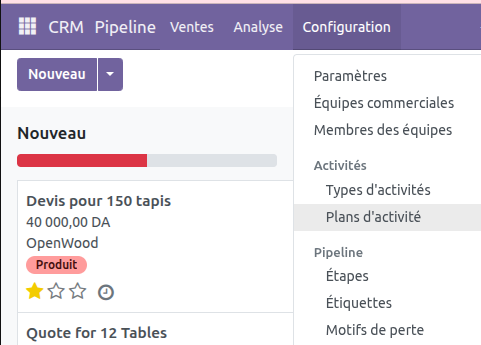
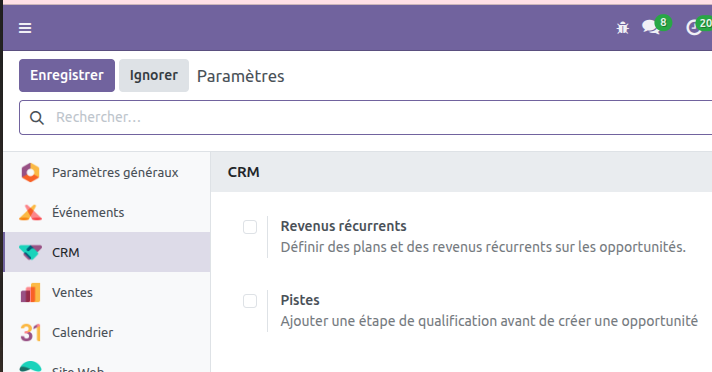
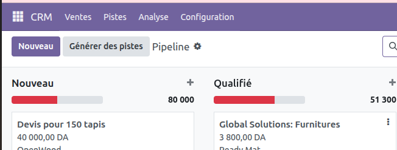
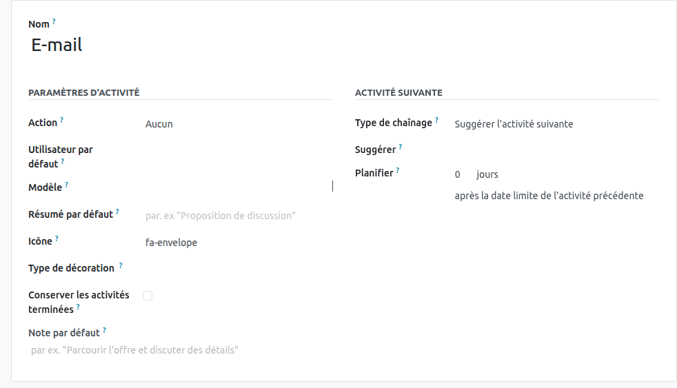
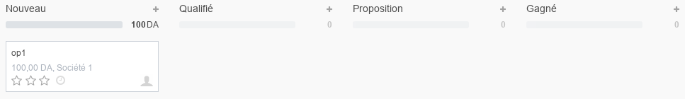
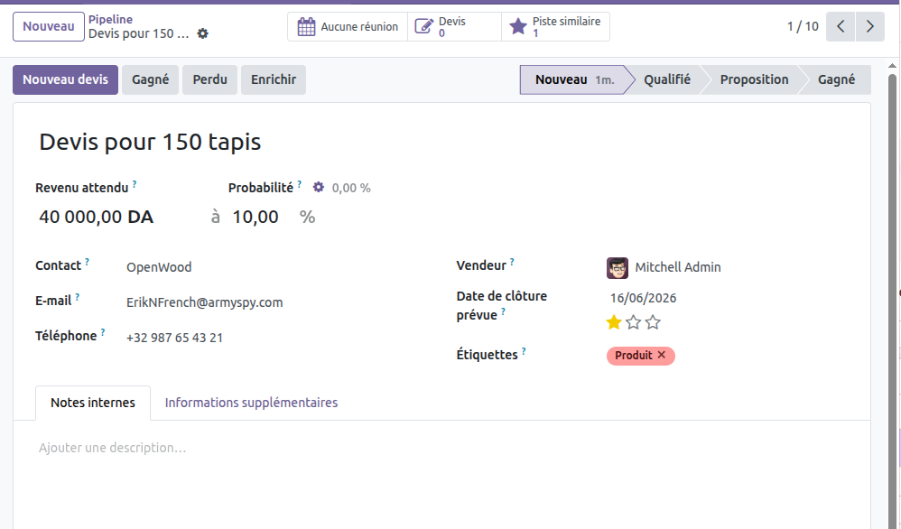
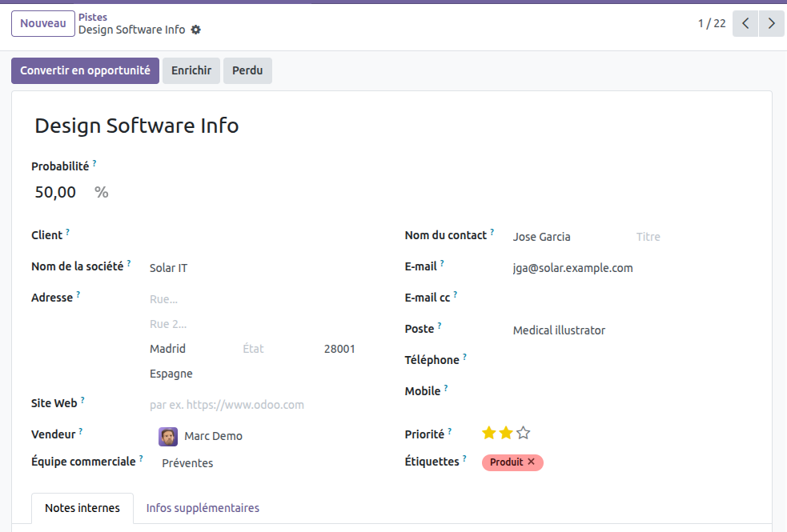
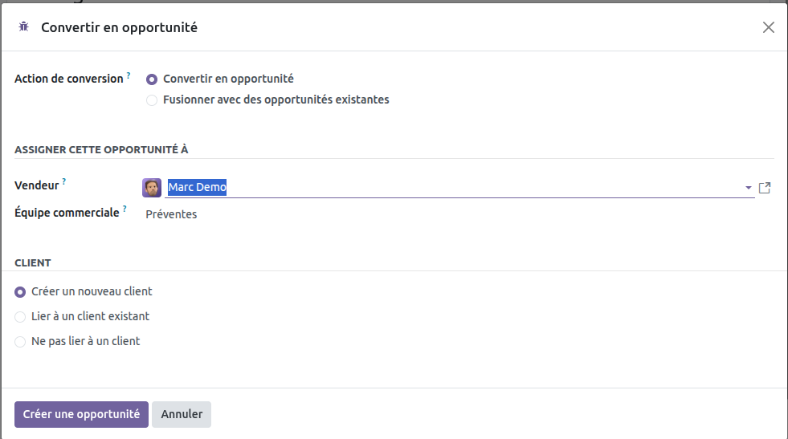
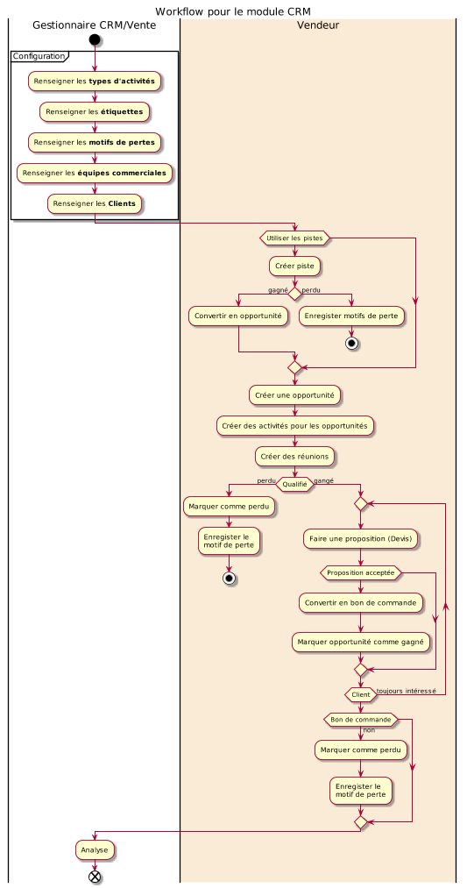

 
<h1 style={{ fontSize: '28px', fontWeight: '700', marginBottom: '0.25rem' }}>
  Module CRM
</h1>
<p style={{ fontSize: '14px', color: 'var(--ifm-color-emphasis-600)', marginBottom: '1.5rem' }}>
  Customer Relationship Management · Odoo 18 Community &amp; Enterprise
</p>
:::info À propos de ce document
Ce document illustre les différentes fonctionnalités du module **CRM** d'Odoo 18. Le CRM (Customer Relationship Management) est le module central de la gestion de la relation client.
:::
 
 **Présentation du module**
 
Ce module, orienté client par excellence, est destiné au suivi des pistes et à l'élaboration des prévisions de vente.
 
| Fonctionnalité | Description |
|---------------|-------------|
| 📊 Données concrètes | Prenez des décisions éclairées basées sur des indicateurs réels |
| 🖥️ Tableaux de bord | Aperçu personnalisé et synthétique de l'activité commerciale |
| 📅 Planification | Organisez vos activités : appels, réunions, mailings et devis |
| 📈 Performances | Suivi en temps réel comparé aux objectifs mensuels |
| ✅ Prochaines actions | Organisez le travail sur la base des actions planifiées |



**Configuration (admin)**
 
:::info Accès restreint
Cette section est réservée aux <strong>Administrateurs</strong> et aux <strong>Gestionnaires des ventes</strong>.
:::
 
Elle permet de définir les paramètres généraux du module : ajout d'une étape de qualification avant création d'une opportunité, génération des pistes, et configuration des équipes commerciales.
 
---
 
**Pistes**
 
L'option **Pistes** active de nouvelles fonctionnalités permettant aux **Vendeurs** de disposer d'une section dédiée à la gestion et qualification des pistes.
 

 
:::info Effet de l'activation
Une fois l'option activée :
- Un nouveau menu **Pistes** apparaît dans la barre de navigation
- Le **Gestionnaire des ventes** peut choisir d'utiliser les **courriels entrants** pour alimenter automatiquement les pistes
:::


---
 
### **Équipes commerciales**
 
Cette section permet de renseigner les informations nécessaires aux équipes commerciales de l'entreprise (responsables, membres, objectifs).
 
➡️ Pour plus de détails, consulter le module [Vente](./odoo-vente.mdx).
 
---
 
### **Types d'activités**
 
Cette section permet de prédéfinir l'ensemble des activités liées à la relation client : appels téléphoniques, envois d'emails, rendez-vous, etc.
 
Pour chaque type d'activité, les paramètres suivants sont configurables :
 

 
---
 
### **Pipeline — Étiquettes**
 
Permet de prédéfinir des étiquettes à associer aux opportunités, comme les types de produits ou services proposés (formation, conseil, intégration, etc.).
 
---
 
### **Pipeline — Motifs de perte**
 
Permet de prédéfinir les raisons pour lesquelles une opportunité ou une piste peut être perdue.
 
**Exemples courants :**

- 💰 Prix trop élevé
- 🧠 Compétences insuffisantes 
- 📦 Stock insuffisant
- ⏳ Délais incompatibles
- 🏆 Concurrent retenu
---
 
## **Vente**
 
### **Mon Pipeline**
 
Le pipeline est l'outil central du CRM. Il permet de suivre l'évolution des opportunités à travers quatre étapes prédéfinies :
 
| Étape | Description |
|-------|-------------|
| 🔵 **Nouveau** | Opportunité créée, non encore qualifiée |
| 🟣 **Qualifié** | Besoin confirmé, contact établi |
| 🟡 **Proposition** | Devis ou offre commerciale envoyée |
| 🟢 **Gagné** | Affaire conclue |
 

 
Pour créer une opportunité, renseignez ses informations dans le formulaire dédié :
 

 
:::info Actions disponibles sur une opportunité
- Générer un ou plusieurs **Devis**
- Marquer comme **Gagnée** ou **Perdue** (avec motif)
- Planifier et suivre les **Réunions** directement depuis le formulaire
:::
---
 
### **Devis**
 
Centralise tous les devis créés par les vendeurs, notamment ceux générés depuis les opportunités du pipeline.
 
➡️ Pour plus de détails, consulter le module [Vente](./odoo-vente.mdx).
 
---
 
### **Pipelines des équipes**
 
Tableau de bord synthétique des ventes réalisées par chaque équipe commerciale.
 
➡️ Identique au tableau de bord du module [Vente](./odoo-vente.mdx).
 
---
 
### **Clients**
 
Liste l'ensemble des clients et prospects ciblés par l'entreprise.
 
➡️ Similaire à la section Clients du module [Vente](./odoo-vente.mdx).
 
---
 
## **Pistes**
 
:::info Prérequis
L'option **Pistes** doit être activée dans la configuration du module pour accéder à cette section.
:::
 
Le **Responsable des ventes** peut créer manuellement de nouvelles pistes, que les vendeurs qualifieront ensuite.
 

 
Une fois qualifiée, une piste peut suivre deux chemins :
 
```
Piste qualifiée
├── ✅ Convertie en opportunité
│     ├── Créer un nouveau client (depuis les infos du contact)
│     └── Fusionner avec un client / une opportunité existante
└── ❌ Marquée comme perdue
```
 

 
---
 
## **Analyse**
 
Accessible aux **Gestionnaires des ventes**, cette section offre des vues synthétiques des données CRM sous trois formats :
 
| Vue | Usage |
|-----|-------|
| 📋 **Liste** | Consultation détaillée ligne par ligne |
| 🔲 **Tableau croisé** | Comparaison par dimensions (vendeur, étape, période) |
| 📊 **Graphiques** | Visualisation des tendances et répartitions |
 
Les données analysables couvrent les **pistes**, le **pipeline** et les **activités**.
 
---
 
## **Workflow**
 
Le diagramme suivant illustre le flux complet des activités CRM, de la création d'une piste jusqu'à la conclusion de l'opportunité.
 

 
---
 
## **Pour aller plus loin**
 
| Ressource | Lien |
|-----------|------|
| Collaboration sur les formulaires | [Fonctionnalité Conversations](./odoo-conversations.mdx) |
| Page produit CRM | [Site officiel Odoo CRM](https://www.odoo.com/fr_FR/page/crm) |
| Documentation technique | [Odoo 18 Docs](https://www.odoo.com/documentation/18.0/applications/sales/crm.html) |
 
---
 
🔗 **Ressource officielle** : [Documentation Odoo](https://www.odoo.com/documentation)
 
<video controls width="100%">
  <source src="/videos/crm-pistes.mp4" type="video/mp4" />
  Votre navigateur ne supporte pas la lecture de vidéos.
</video>