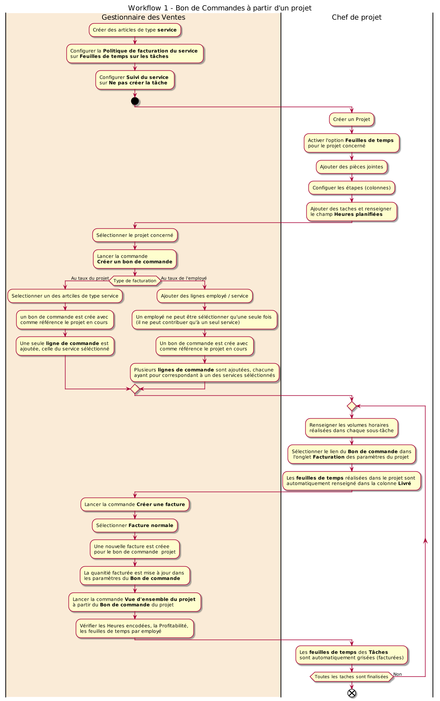
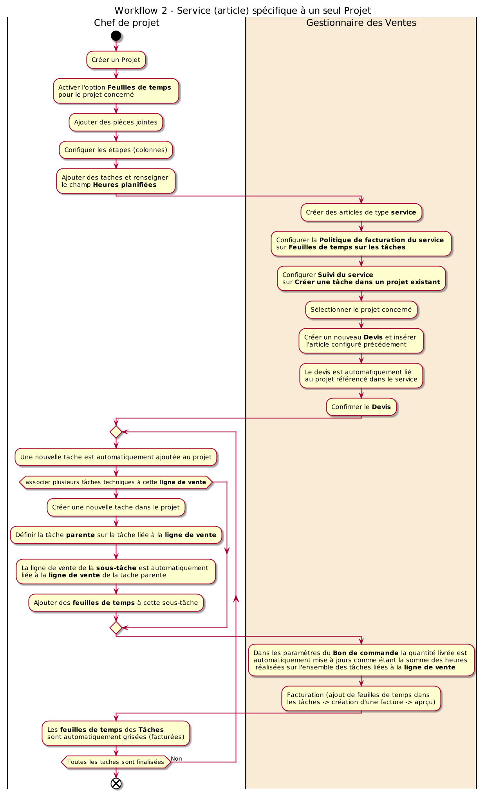
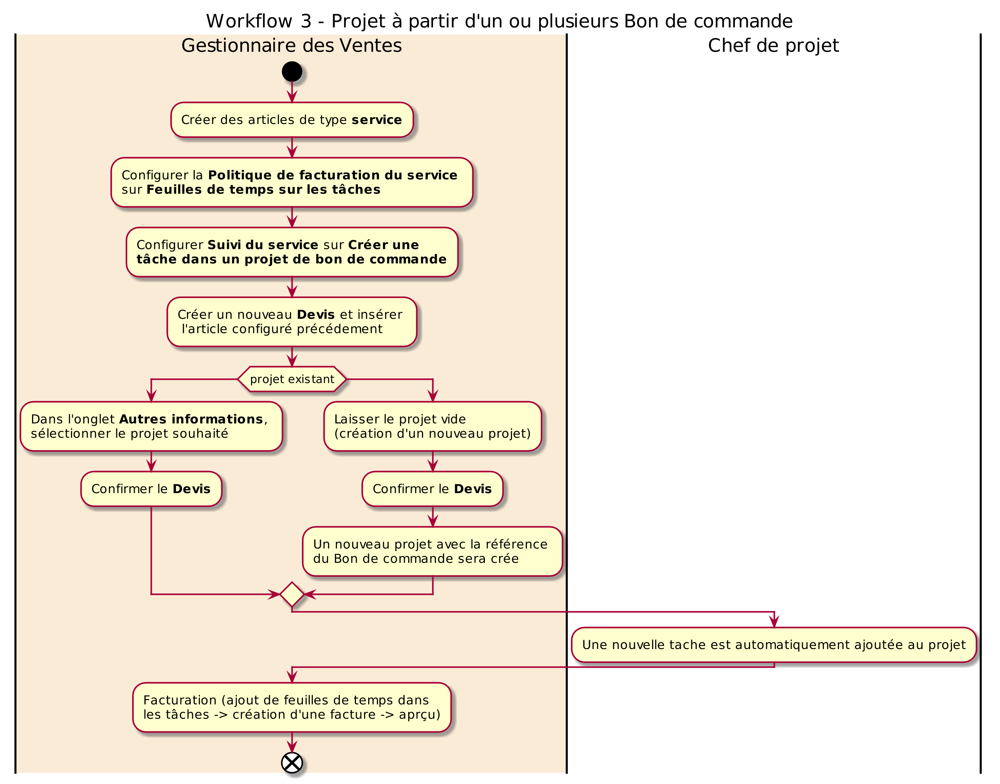
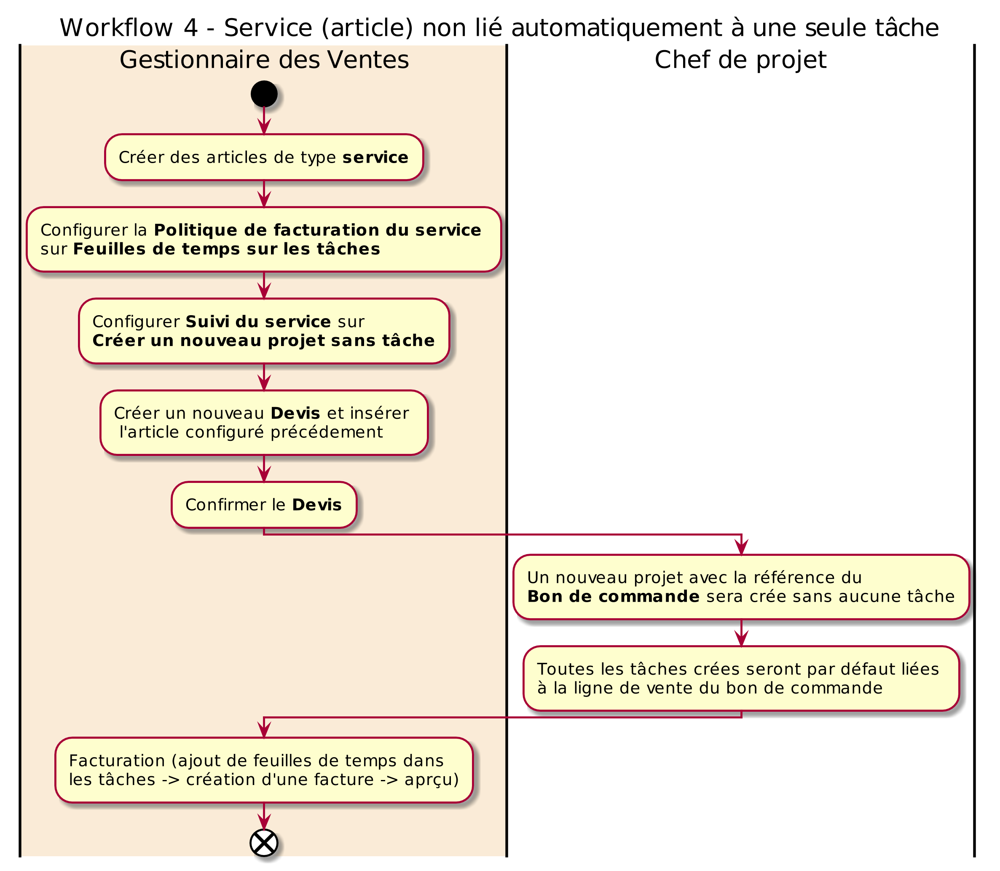
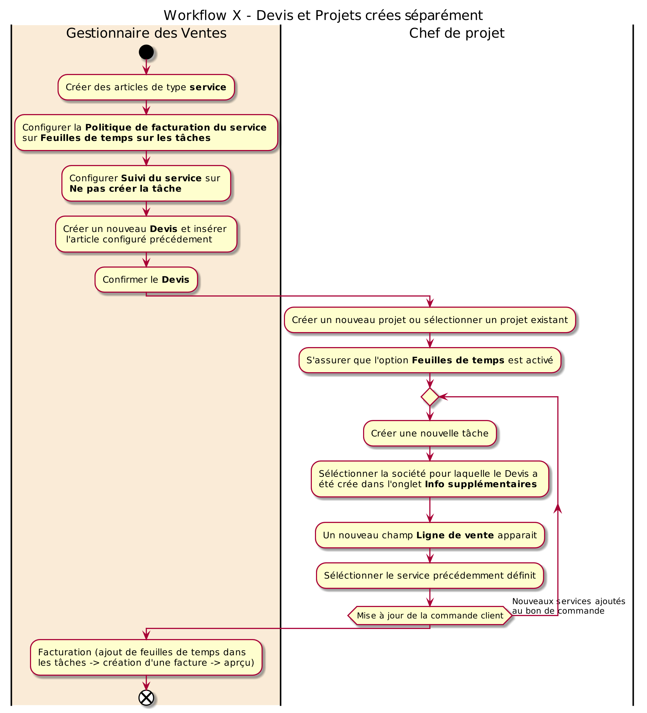

# Scénario de déploiement pour une gestion par projet

Ce document décrit quelques lignes directrices pour un déploiement progressif d'odoo 13 community dans une petite ou moyenne entreprise/industrie (PME/PMI) dont la gestion est **orientée Projets**.

Il est structuré sous forme d'activités d'apprentissage destinées aux utilisateurs finaux et dédiées à chaque module.

## Prérequis

- une installation propre d'odoo ERP. Pour un deployment avec docker consulter [setup odoo on docker.](https://enlight-me.github.io/docker-usecases/setup-images-on-docker/odoo-on-docker.html)
- préconfiguration et personnalisation d'odoo selon les spécificités de l'entreprise, particulièrement la **création des comptes utilisateurs pour chaque apprenant**. Pour plus de détails consulter la section [configuration](./odoo-deploy-guidelines.mdx#configuration).

## Sommaire

* [Hypothèses](#hypothèses)
* [Module Messages](#module-messages)
* [Module Employés](#module-employés)
* [Module Vente](#module-vente)
* [Module Projet - activités de base](#module-projet- )
* [Module Projet - activités avancés](#module-projet-activités-avancées)
* [Modules additionnels](#modules-additionnels)
* [Module Additionnel Scrum](#module-scrum)

## Hypothèses

- Petite ou Moyenne Entreprise/Industrie (PME/PMI) de 20 personnes.
- Le déploiement final se feait de manière progressive (par module) avec une durrée d'absorption d'au moins **deux (02) semaines**.
- Groupes de 8 à 10 apprenants ayant chacun mis à jour son profil utilisateur.
- Processus métier simples et maturés. Si les processus n'existent pas il faudra les crées.
- Outils de collaboration : tableau blanc, post-it, marqueurs, ...
- Equipe projet composé d'un chef de projet et de membres ayant une autorité suffisante sur les activités qui seront implémentées.

## Module Messages

Les activités d'apprentissage du [Module Messages](./odoo-messages.mdx) sont :

1. lister les départements / fonctions / projets existants dans l'entreprise et constituer des groupes dont les conversations sont privés selon la liste ci-dessus.
1. définir les interactions entre les différents groupes.
1. définir des sujets de discussions directes entre deux (02) interloculteurs.
1. définir les types d'informations dont la diffusion est générale à tous les employés.

Pour chaque activité, créer les cannaux correspondants et produire du contenu (texte, emojis, fichiers attachés, ...).

[Retour au sommaire](#sommaire)

## Module Employés

Les activités d'apprentissage du [Module Employés](./odoo-employee.mdx) sont :

1. identifier la hiérarchie des structures existantes dans l'entreprise et les postes de travail.
1. créer les départements.
1. créer les postes de travail.
1. créer des employés gestionnaires et les associés aux départements.
1. créer des employés collaborateurs.
1. associés des employés à des comptes utilisateurs et inviter les à se connecter.

[Retour au sommaire](#sommaire)

## Module Vente

Les activités d'apprentissage du [Module Vente](./odoo-vente.mdx) sont :

1. identifier **sur papier** puis mettre à jours les paramètres suivants :
    1. caractéristiques principales des articles vendus par l'entreprise ainsi que les éventuelles variantes.
    1. créer des comptes utilisateurs pour les commerciaux de l'entreprise, puis intégrer les dans des équipes commerciales.
1. selon le cas, renseigner au moins 10 **articles** vendus par l'entreprise, ainsi que 10 **clients**.
1. créer au moins 05 **devis** avec toutes les informations nécessaires y compris des articles optionnels. Imprimer-les et envoyer-les par mail puis Confirmer-les.
1. créer des **factures** pour les bon de commandes.

[Retour au sommaire](#sommaire)

## Module Projet - activités de base

Les activités de base d'apprentissage du [Module Projet](./odoo-project.mdx) sont :

1. identifier **sur papier** puis mettre à jours les paramètres suivants :
    1. Types d'activités.
    1. Etiquettes des taches.
1. si nécessaire, créer des employés pour les membres des équipes projets de l'entreprise et leur associés des utilisateurs.
1. si nécessaire, renseigner au moins 05 clients.
1. créer au moins 02 projets et renseigner les informations y relatives.
1. ajouter des pièces jointes de différents formats aux projets.
1. dans la partie **Projets** sélection un des projets :
    1. ajouter des colonnes (TODO, WIP, DONE).
    1. paramétrer chaque colone.
1. ajouter des tâches dans chaque étape du projets.
1. editer les tâches et renseigner les informations y relatives.
1. faite glisser les taches entre les différentes étapes et constater les changments dans la partie analyse.
1. modifier l'état des tâches et constater le indicateurs couleurs sur le kanban projet et dans la partie **Toutes les taches**.

[Retour au sommaire](#sommaire)

## Module projet - activités avancées

Les activités d'apprentissage avancées de ce module sont :

1. identifier **sur papier** les éléments suivants :
    1. projets en cours au niveau de l'entreprise.
    1. tâches relatives à chaque projet.
    1. sous-taches des taches listées ci-avant.

1. avec l'option **_Utiliser les évaluations de projet_** activé dans la configuration :
    1. **cette option nécessite des informations client fiables, ainsi que la configuration d'un serveur de messagerie et/ou l'accès client au portail de l'entreprise**.
    1. pour l'un des projets identifiés, définir un **_Modèle d'email pour les évaluations_** pour chaque étape.
    1. le client recevra un email de demande d'evaluation chaque fois q'une tâche progresse dans le pipeline et les feedbacks seront visibles directement dans la vue kanban du projets avec chaque tâche.

1. avec l'option **_Sous-tâches_** activé dans la configuration :
    1. renseigner les informations relatives à un des projets identifiés.
    1. renseigner les tâches du projet.
    1. créer les sous-tâches en les reliants à leurs taches parentes.
    1. assigner les taches/sous-tâches à des membres de l'équipe.
    1. chaque membre constate la liste des tâches qui lui sont assignés et les fait progrésser dans le pipeline.
    1. refaire l'opération pour les autres projets identifiés.
    1. créer une hiérarchie de projets en les reliants avec le champ **_Sous-tache du projet_**.

1. avec l'option **_Feuilles de temps sur les tâches_** activé dans la configuration.
    1. pour l'un des projets identifiés, activé l'option **_Feuilles de temps_**.
    1. créer un nouveau modèle de **Temps de travail** adapté à la législation locale (Heures de travail, Congé Global).
    1. renseigner le **_Coût de la feuille de temps_** pour chaque membre de l'équipe (module employés).
    1. pour chaque tâche du projet selectionnée, renseigner le champ **_Heures planifiées_**.
    1. les membres d'équipes peuvent maintenant renseigner leurs apports en volume horaire à chaque tâche et visualiser les heures restantes dans la vue kanban du projet.
    1. visualiser les changements dans la partie analyse après chaque modification sur les horaires travailés par employé / par tache / par projet.
    1. dans le module **_Feuilles de temps_** :
        1. chaque membre de l'équipe visulise ses feuilles de temps.
        1. visualiser la liste de toutes les feuilles de temps.
        1. faite des analyses par employé / par tache / par projet.
        1. changer l'option **_Unité d'encodage_** dans la configuration et visualiser les modifications apportées aux informations projets / taches / feuilles de temps du module Projet.
    1. refaire l'opération pour les autres projets identifiés.

[Retour au sommaire](#sommaire)

## Intégration modules Projet avec Vente

**NB :** Il est primordiale de créer des lignes de ventes (artciles de type service) indépendantes des aspects techniques, et de gérer ces derniers (aspects techniques) comme des tâches dans le projet.

**Workflow 1 : Bon de Commandes à partir d'un projet**

1. dans le module **Vente** créer des articles de type service et configurer la **_Politique de facturation du service_** sur **_Feuilles de temps sur les tâches_**. et **_Suivi du service_** sur **_Ne pas créer la tâche_**.
1. pour l'un des projets identifiés, activé l'option **_Feuilles de temps_**.
1. lancer la commande **_Créer un bon de commande_**.
1. si le type de facturation est définie sur **_Au taux du projet_**.
    1. selectionner un des artciles de type service.
    1. un bon de commande est crée avec comme référence le projet en cours.
    1. on constate qu'une seule **ligne de commande** est ajoutée, celle du service séléctionné.
1. si le type de facturation est définie sur **_Au taux de l'employé_**.
    1. ajouter des lignes employé / service.
    1. un employé ne peut être séléctionner qu'une seule fois, çad qu'il ne peut contribuer qu'à un seul service.
    1. un bon de commande est crée avec comme référence le projet en cours.
    1. on constate que plusieurs **lignes de commande** sont ajoutées, chacune pour correspondant à un des services séléctionnés.
1. retour dans le module projet.
1. sélectionner quelques tâches du projet en cours et ajouter des **_feuilles de temps_**, pour faire progrésser le taux d'avancement.
1. dans les paramètres du projet en cours, onglet **_Facturation_**,  sélectionner le lien du **_Bon de commande_** correspondant.
1. les heures (feuilles de temps) réalisées dans le projet sont automatiquement renseigné dans la colonne Livré.
1. lancer la commande **_Créer une facture_**, sélectionner **_Facture normale_**.
1. une nouvelle facture est crée pour le projet / bon de commande.
1. revenir aux paramètres du **Bon de commande**. on constate que la quanitié facturée est mise à jour.
1. si on vérifie les feuilles de temps enregistrées dans la **Tâches**, on constate qu'elles sont grisées et impossible à modifier puisqu'elles ont déjà été facturées.  
1. revenir aux paramètres du **Bon de commande** du projet. lancer la commande **_Vue d'ensemble du projet_**, on obtient un rapport détaillant les Heures encodées, la Profitabilité, les feuilles de temps par employé, ...
1. aussi, dans la page des paramètres du **Bon de commande** du projet, lancer la commande **_Aperçu client_**, on obtient un rapport mise en forme tel qu'il sera visible par le client.
1. pour facturer de nouveau, il faute faire progrésser le projet en renseignant de nouvelles lignes de feuilles de temps dans les paramètres des Tâches. ainsi, à chaque jalon du projet, une facture particulière peut être générée.
1. pour associer plusieurs tâches techniques à une même **ligne de vente** (cas général), créer une nouvelle tache dans le projet. dans l'onglet **_infos supplémentaires_** de la tâche sélectionner la **Ligne de vente** désirée. ajouter des **feuilles de temps** à cette tâche.
1. revenir aux paramètres du **Bon de commande**. on constate que la quantité livrée est automatiquement mise à jours comme étant la somme des heurs réalisées sur l'ensemble des tâches liées à la **ligne de vente**.

**Workflow 2 : Service (article) spécifique à un seul Projet**

1. pour l'un des projets identifiés, activé l'option **_Feuilles de temps_**.
1. dans le module **Vente** créer des articles de type service et configurer la **_Politique de facturation du service_** sur **_Feuilles de temps sur les tâches_**. et **_Suivi du service_** sur **_Créer une tâche dans un projet existant_**.
1. créer un nouveau **Devis** et insérer l'article configuré précédement. on constate que le devis est automatiquement lié au projet référencé dans les paramètres de l'article (service).
1. confirmer le **Devis** pour le transformer en **Bon de commande**.
1. dans le module projet, on constate qu'une nouvelle tache est automatiquement ajoutée au projet en cours et la ligne de vente fait référence au bon de commande crée.
1. la facturation est effectuée de la même manière que dans le workflow précédent (ajout de feuilles de temps dans les tâches -> création d'une facture -> aprçu).
1. pour associer plusieurs tâches techniques à cette **ligne de vente**, créer une nouvelle tache dans le projet. dans l'onglet **_infos supplémentaires_** de la tâche, définir la tâche **parent** sur la tâche liée à la **ligne de vente**. on constate que la ligne de vente de la sous-tâche est automatiquement définie sur la ligne de vente de la tache parente. ajouter des **feuilles de temps** à cette sous-tâche.
1. revenir aux paramètres du **Bon de commande**. on constate que la quantité livrée est automatiquement mise à jours comme étant la somme des heurs réalisées sur l'ensemble des tâches liées à la **ligne de vente**.

**Workflow 3 : Projet à partir d'un ou plusieurs Bon de commande**

1. dans le module **Vente** créer des articles de type service et configurer la **_Politique de facturation du service_** sur **_Feuilles de temps sur les tâches_**. et **_Suivi du service_** sur **_Créer une tâche dans un projet de bon de commande_**.
1. créer un nouveau **Devis** et insérer l'article configuré précédement. dans l'onglet **_Autres informations_**, sélectionner le projet souhaité. **_Confirmer_** le **Devis** (transformer en **Bon de commande**).  
1. si dans l'étape précédente le projet est laissé vide, un nouveau projet avec la référence du Bon de commande sera crée (**situation indésirable**).
1. dans le module projet, on constate qu'une nouvelle tache est automatiquement ajoutée au projet en cours et la ligne de vente fait référence au bon de commande crée.
1. la facturation est effectuée de la même manière que dans les workflows précédents (ajout de tâches/sous-tâches techniques -> ajout de feuilles de temps -> création d'une facture -> aprçu).

**Workflow 4 : Service (article) non lié automatiquement à une seule tâche**

1. dans le module **Vente** créer des articles de type service et configurer la **_Politique de facturation du service_** sur **_Feuilles de temps sur les tâches_**. et **_Suivi du service_** sur **_Créer un nouveau projet sans tâche_** (çad Devis).
1. créer un nouveau **Devis** et insérer l'article configuré précédement. **_Confirmer_** le **Devis** (transformer en **Bon de commande**).
1. un nouveau projet avec la référence du **Bon de commande** sera crée sans aucune tâche.
1. toutes les nouvelles tâches créer dans ce projet seront par défaut liées à la ligne de vente définie lors de la création du bon de commande. bien sûre le gestionnaire de projet peut les **lignes de ventes** à tout moment.
1. la facturation est effectuée de la même manière que dans les workflows précédents (ajout de tâches/sous-tâches techniques -> ajout de feuilles de temps -> création d'une facture -> aprçu).

**Workflow X : Devis et Projets crées séparément**

1. dans le module **Vente** créer des articles de type service et configurer la **_Politique de facturation du service_** sur **_Feuilles de temps sur les tâches_**. et **_Suivi du service_** sur **_Ne pas créer la tâche_**.
1. créer un nouveau **Devis** et insérer le sevice (article) configuré précédement.
1. confirmer le **Devis** pour le transformer en **Bon de commande**.
1. dans le module projet, crée un nouveau projet ou sélectionner un projet existant. s'assurer que l'option **_Feuilles de temps_** est activé.
1. créer une nouvelle tâche. dans l'onglet **Info supplémentaires** séléctionner la société pour laquelle le Devis a été crée.
1. un nouveau champ **Ligne de vente** apparait. séléctionner le service (article) précédement définit.
1. la facturation est effectuée de la même manière que dans les workflows précédents (ajout de tâches/sous-tâches techniques -> ajout de feuilles de temps -> création d'une facture -> aprçu).
1. maintenant vous pouver ajouter autant de services au bon de commande et y lier autant de tâches que nécessaires :).

[Retour au sommaire](#sommaire)

## Module Additionnel Scrum

Les activités de base d'apprentissage du [Module Projet Scrum](./odoo-add-project-scrum.mdx) sont :

1. identifier **sur papier** puis mettre à jours les paramètres suivants :
    1. Les projets gérés par la méthode Scrum.
    1. Les périodes durant lesquelles les **Sprints** sont exécutés et les éventuelles périodes **Breath**.
    1. Les Equipes Scrum impliquées.
1. créer un nouevau projet et lui associer un équipe Scrum.
1. créer des tâches dans le projet et associées les aux sprints.

----
🔗 **Official Resource**: [Odoo Documentation](https://www.odoo.com/documentation)

