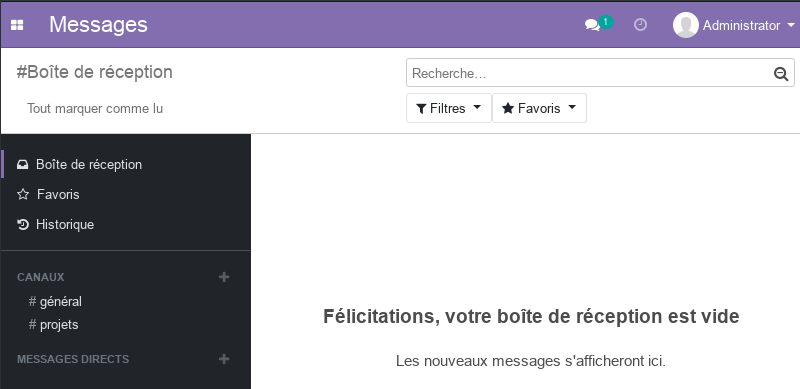
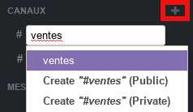
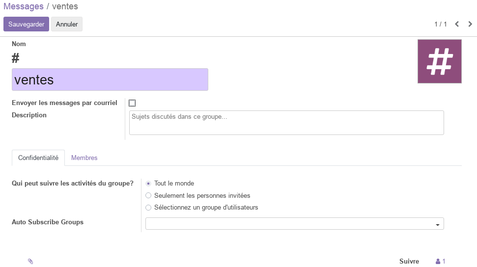
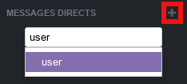
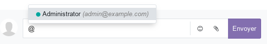

# Module Messages

Ce document illustre les différentes fonctionnalités du module **Messages** d'odoo 13 community. 

## Aperçu 

Ce module basic permet d'améliorez la communication en équipe. Il permet de créer des canaux de discussions privées ou en groupe.

Les messages étant intégrés à tous les modules odoo, cela permet de collaborer sur chaque sujet (facture, devis, employé, article, ...).

## Créer un nouveau canal 
- Les canaux publics permettent de diffuser des informations à tous les employées et de recevoir/discuter les feedback afin d'apporter des éclaircissements si nécessaire.
- Les cannaux privés permettent aux équipes de discuter des sujets qui les concernent (projets, ventes, RH, marketing, ...)

Une fois le canal privé ou public crée, vous pouvez définir ses propriétes, comme le nom, la description, la confidentialités et les membres.

## Messages directes

Les messages directes sont envoyer directement à la personne concernée sur un canal **MESSAGES DIRECTS**. Ils ne sont visibles que par les interlocuteurs.

## Créer du contenu (messages)

Les messages envoyés dans les cannaux publics, privés ou directes peuvent contenir du texte, des émojis, et des fichiers attachés (images, pdf, text, ...).

- avec **/** vous aver accès à des commandes spécifiques au canal (help, who, leave).
- avec **@** vous pouver alerter un utilisateur qui recevrera une notifcation dans la barre des **conversations**.
- avec **:** vous pouver faire appel a une activité (nécessite module LiveChat).

## Plus de détails 

- Pour la collaboration, consulter la fonctionnalité [conversations](./odoo-conversations.mdx).
- [Site officiel d'odoo](https://www.odoo.com/fr_FR/page/discuss).  

----
🔗 **Official Resource**: [Odoo Documentation](https://www.odoo.com/documentation)

