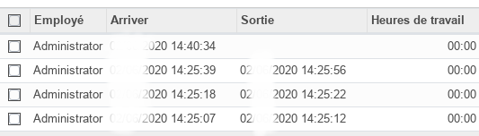
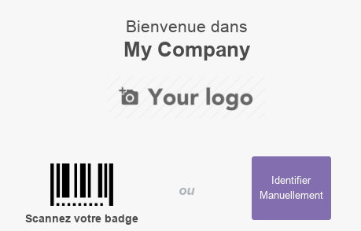
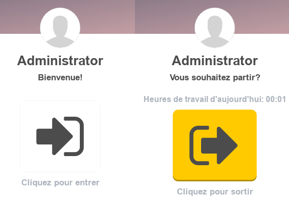
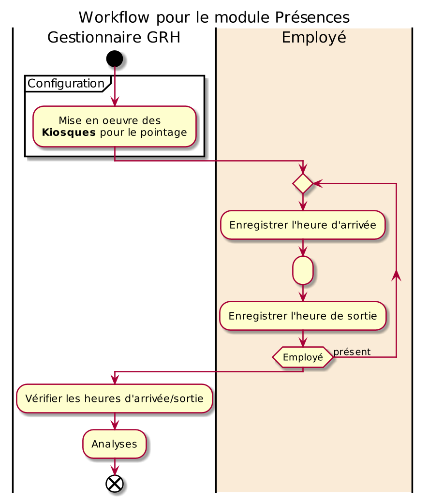

# Module Présence

Ce document illustre les différentes fonctionnalités du module **Présences** d'odoo 13 community.

## Présentation du module

Ce module complémentaire au module **Employés** est destiné à gérer les présences/absences des employés de l'entreprise de manière efficace.

## Configuration (admin)

Cette section, réservée aux **administrateurs**, permet de définir les paramètres généraux du module, tel que les **_Check-In/Out_**.

En effet, l'option **_PIN de l'employé_** active une fonctionnalité permettant aux **GRH** de définir des PIN pour chaque employé qui doivent les saisir au moment du pointage.

## Gestionnaire

Cette section est déstinée aux **Gestionnaires des Ressources Humaines**.

### Présences

Cette section basique, permet de vérifier et corriger si nécessaire les heures d'arrivées/sortie de tous les employés.

### Employés

Cette section est la même que celle du module [Employés](./odoo-employee.mdx#emlpoyes).

### Mode kiosque

Cette fonctionnalité est généralement activé par le **GRH** sur un ou plusieurs postes dédiés à partir desquels les employés peuvent pointer (entegister leurs arrivées/départs), que çà soit en scannant un badge ou en s'identifiant manuellement. Si l'option **_PIN de l'employé_** est activé le PIN est exigé pour le pointage.

## Check in / Check out

Cett interfaçe permet aux utilisateurs d'Odoo d'enregister leurs l'heurs d'arrivée et de départ sur une interface ludique et simple.

## Analyse

La partie analyse permet aux **GRH** de visualiser des vues synthétiques sous différentes formes (listes, tableau croisé ou graphes) de la situation des **présences des employés**.

## Workflow

## Plus de détails

- Pour la collaboration sur les formulaires de ce module, consulter la fonctionnalité [conversations](./odoo-conversations.mdx).
- [Site officiel d'odoo](https://www.odoo.com/fr_FR/page/employees).

----
🔗 **Official Resource**: [Odoo Documentation](https://www.odoo.com/documentation)

