# Module Projet

Ce document illustre les différentes fonctionnalités du module **Projet** d'odoo 13 community.

## Présentation du module

Ce module est destiné à la gestion de projets agiles. Il permet :

- de vérifiez facilement les horaires des équipes et de les replanifier pour garder les échéances.
- de gardez une trace des échéances et de la progression des projets grâce à un aperçu claire.
- de gardez un bonne vue sur la charge de travail et sur le statut des tâches individuelles.
- de programmez les équipes à travers les différents projets en prenant en compte les vacances des employés.
-de planifiez à l'avance les futurs projets sur base des projets similaires et estimez les échéances plus précisément.
- de comparez les prévisions avec les feuilles de temps effectives pour améliorer la rentabilité.
- de divisez les projets en petites tâches et de les assignez à l'équipe pour augmenter la collaboration.
- de créez des étapes personnalisées pour chaque projet afin de simplifier l'aperçu sur le travail et améliorer l'efficacité générale du projet.

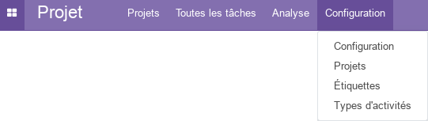

## Configuration (admin)

Cette section, réservée aux **administrateurs** et **Gestionnaires des ventes**, permet de définir les paramètres généraux du module, tel que la gestion des tâches et du temps.

#### Gestion des tâches

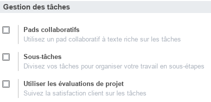

- L'option **_Pads collaboratifs_** permet d'utiliser des outils intégrés d'édition de texte collaboratifs (**option nécessitant une clé API**).
- L'option **_Sous-tâches_** permet de créer une hiérarchie entre les taches en définissant des **taches parentes**.
- L'option **_Utiliser les évaluations de projet_** active de nouvelles fonctionnalités permettant aux **Gestionnaires des projets** de recevoir des évaluations de la satisfatcion des  clients par emails. Des modèles d'emails de demmande d'évaluation peuvent être définie pour chaque étape. Les évaluations sont visibles directement sur les taches.

#### Gestion du temps

- L'option **_Feuilles de temps sur les tâches_** active de nouvelles fonctionnalités permettant aux **Gestionnaires des projets** d'enregister les volumes horaires réellement alloués à chaque tâche par employé et par projet.

### Projets (Configuration)

Cette section permet de gérer les projets de l'entreprise en renseignant toutes les informations utiles, tel que le nom, le responsable, le client, la visibilité et le mode de planification du temps.

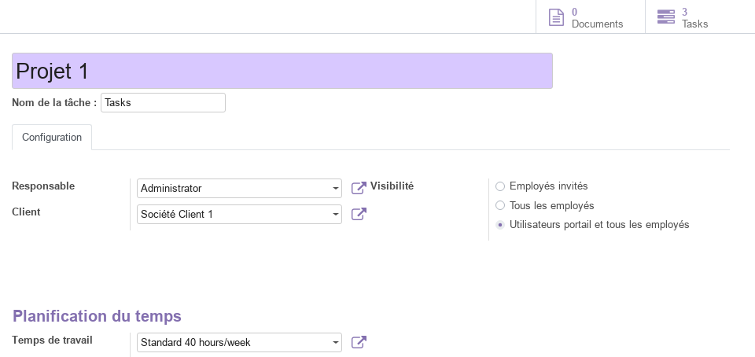

Cette vue permet d'avoir un aperçu direct sur le nombre de **Tâches** du projet et les **Documents** asscociés (pièces jointes). En effet plusieurs pièces jointes, de différents formats (url, pdf, doc, xls, ..) peuvent être associés au projet tel que des contrats, des rapports, des liens ...

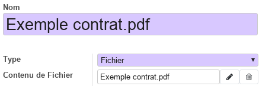

### Étiquettes

Cette section permet de prédéfinir des étiquettes a associé aux taches, tel que : besoin d'assistance, suspendu, ...

### Types d'activités

Cette section permet de prédéfinir l'ensemble des activités liées aux taches du projet, tel que les appels téléphoniques, l'envoi d'emails, les rendez-vous, ...

## Projets

Cette partie offre une vue en kanban de l'ensemble des projets de l'entreprise. Pour chaque projet, on peut visualiser le nom, le client, le nombre de taches, ...

Aussi, à partir du menu contextuel, on peut accéder directement aux paramètres du projet avec la commande **_Modifier_** et lui affecter une couleur distinctive en fonction de sont type par exemple.

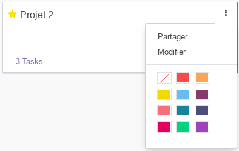

En sélectionnant un projet, on passe vers une vue en kanban où chaque tâche du projet est disposé dans une colone correposnadante à l'**étape** dans laquelle la tache se trouve actuellement. Voir section [Tâches](#toutes-les-tâches) pour plus de détails.

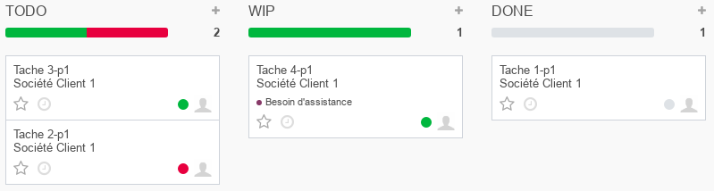

Pour chaque étape (colone) un ensemble de paramètres peuvent être définis avec la commande **_Editer l'étape_**.

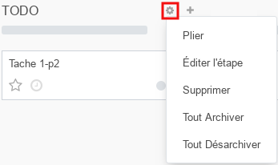

Ainsi, pour chaque étape on peut définir :

- le nom.
- si elle doit être automatiquement repliée dans le kanban.
- le modèle de mail a envoyer lorsqu'une tâche atteint cette étape.
- la descritpion des codes couleurs (gris, vert, rouge) de l'état de la tâche qui s'affiche sous forme de point dans la carte kanban de la tâche.

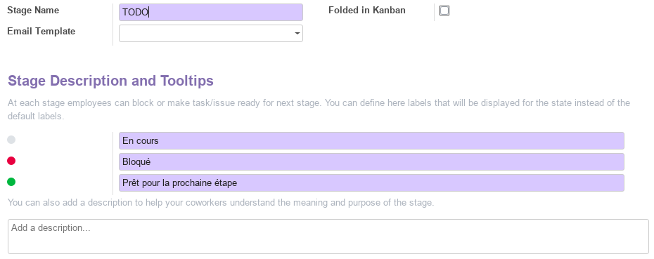

## Toutes les tâches

Cette partie offre une vue globale de toutes les taches assignées à l'**utilisateur** connecté actuellement (vue personnalisé). Pour chaque tâche le **gestionnaire de projet** peut renseigner l'ensemble des informations nécessaires, tel que : le nom, la date limite, le responsables, ...

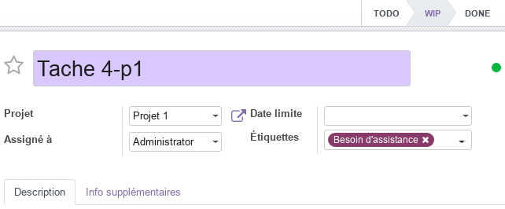

## Analyse

La partie analyse permet aux **Gestionnaires de projets** de visualiser des vues synthétiques sous différentes formes (listes, tableau croisé ou graphes) de la situation des **projets** et des **taches**.

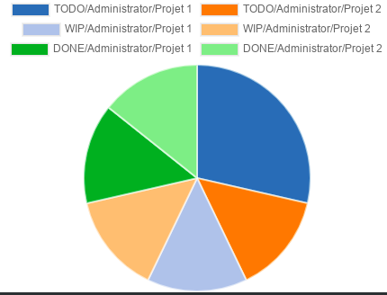

## Workflow

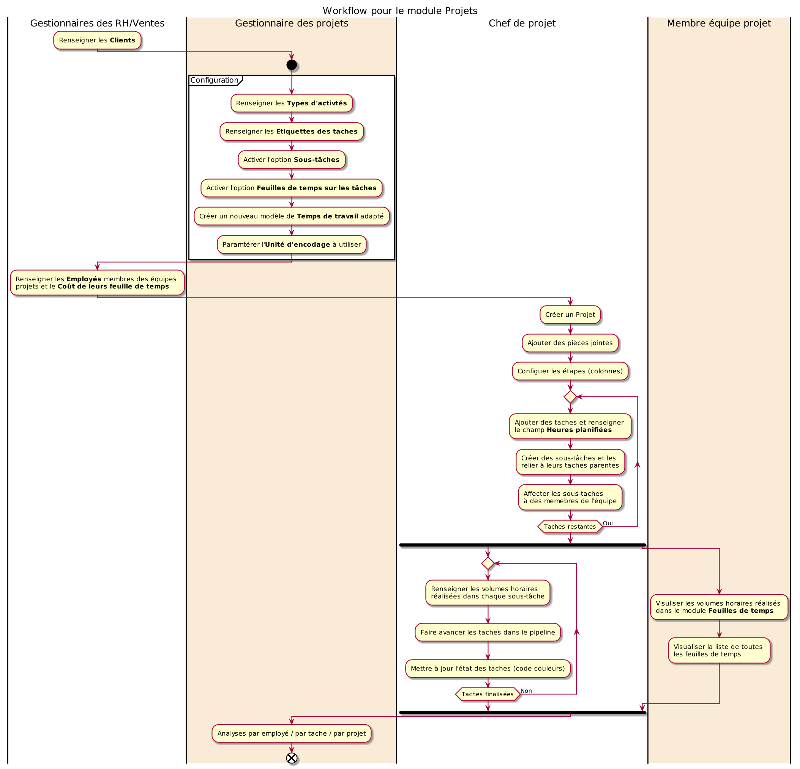

## Plus de détails

- Pour la collaboration sur les formulaires de ce module, consulter la fonctionnalité [conversations](./odoo-conversations.mdx).
- [Site officiel d'odoo](https://www.odoo.com/fr_FR/page/project-management).  

----
🔗 **Official Resource**: [Odoo Documentation](https://www.odoo.com/documentation)

