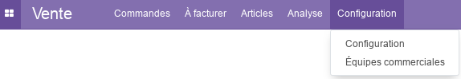
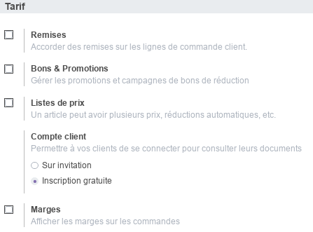
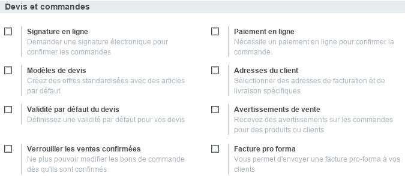
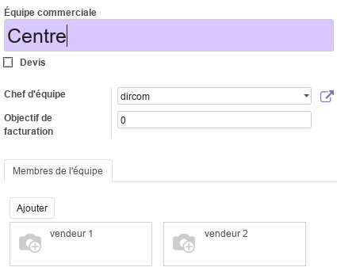
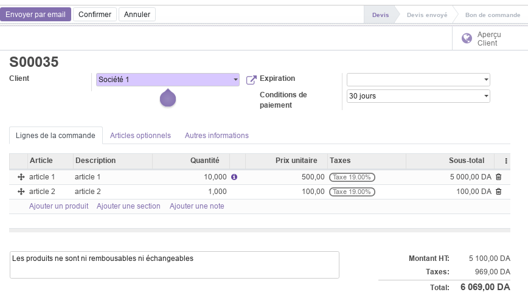
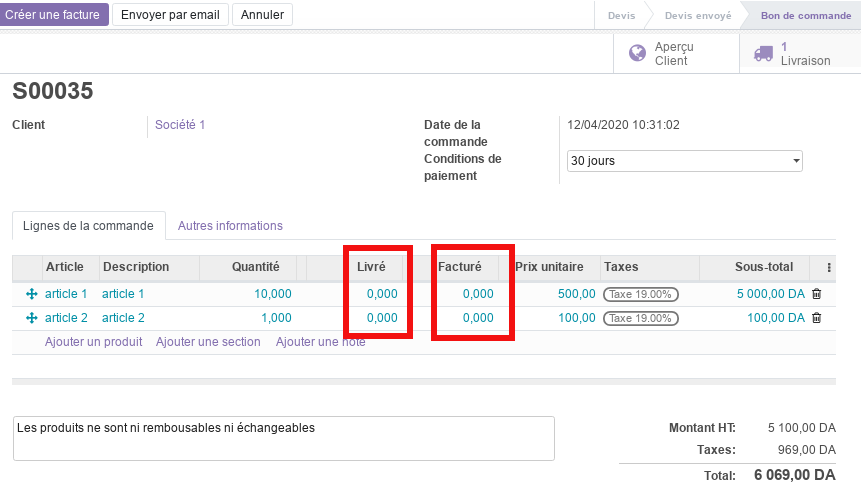
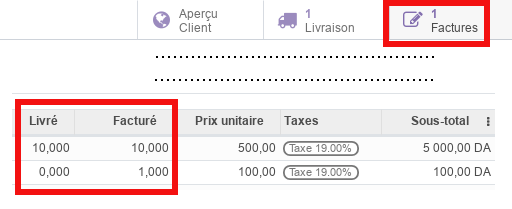
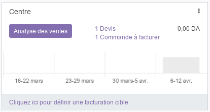
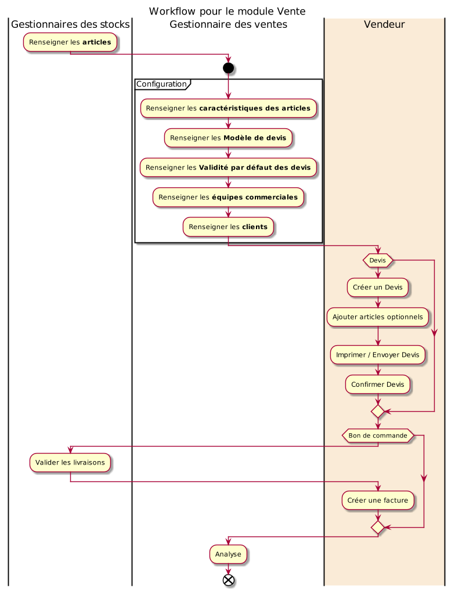

# Module Vente

Ce document illustre les différentes fonctionnalités du module **Vente** d'odoo 13 community.

## Présentation du module

Ce module est destiné à la gestion des devis professionnels. Il permet :

- de facturer les clients, d'enregistrez les contrats, de suivre les étapes de facturation et de maintenir les opportunités de renouvellement et de vente incitative.
- de présentez les produits et services de manière profesionnelle.
- d'envoyez des devis clairs et complets aux prospects et de gardez automatiquement une trace des échanges avec les clients.
- de créez des alertes personnalisées pour les activités.
- d'augmentez le volume des ventes en proposant automatiquement des accessoires ou des options supplémentaires telles qu’une remise.
- de créez, déployez et ajustez la stratégie de prix afin de maximiser les revenus.

## Configuration (admin)

Cette section, réservée aux **administrateurs** et **Gestionnaires des ventes**, permet de définir les paramètres généraux du module, tel que le configurateur de produits, les tarifs, les devis, les commandes, l'exépdition et la facturation.

#### Configuration d'articles

Cette partie, permet de définir les paramètres du **_Configurateur de produits_**, qui offre au **Gestionnaires des ventes** la possibilité de renseigner des variantes d'articles pour chaque produit ou services. Pour plus d'informations consulter le module [Stock](./odoo-stock.mdx#articles)

#### Configuration des Tarif

- L'option **_Remise_** permet aux vendeurs de proposer des remises sur des articles.
- L'option **_Bons & Promotions_** active de nouvelles fonctionnalités permettant aux **Gestionnaires des ventes** d'initier des campagnes de promotions et de bons de réductions.
- L'option **_Liste de prix_** active une nouvelle fonctionnalité permettant aux **Gestionnaires des ventes** de définir plusieurs prix pour chaque article en fonction de périodes pédéterminées.
- L'option **_Compte client_** permet de définir le type d'accès accodré aux clients sur le portail de l'entreprise.
- L'option **_Marges_** permet au vendeurs d'afficher les marges sur les commandes.  

#### Configuration des Devis et commandes

- L'option **_Signature en ligne_** permet aux vendeurs de demander une signature éléctronique pour confirmer les commandes.
- L'option **_Paiement en ligne_** permet aux **Gestionnaires des ventes** d'activer les paiement en lignes des factures.
- L'option **_Modèle de devis_** active de nouvelles fonctionnalités permettant aux **Gestionnaires des ventes** de créer des modèles prédéfinis réutilisables.
- L'option **_Adresses du client_** permet aux vendeurs de sélectionner des adresses de facturation et de livraison spécifiques.
- L'option **_Validité par défaut du devis_** permet aux **Gestionnaires des ventes** de définire une validité par défaut pour les devis (ex. 30 jours).
- L'option **_Avertissements de vente_** permet aux **vendeurs** de recevoire des avertissements sur les commandes pour des produits ou clients spécifiques.
- L'option **_Verrouiller les ventes confirmées_** permet de ne plus pouvoir modifier les bons de commande dès qu'ils sont confirmés.
- L'option **_Facture pro forma_** permet aux **vendeurs** d'envoyer des factures pro-forma aux clients.

#### Configuration de l'Expédition

- L'option **_Frais de livraison_** permet aux **vendeurs** de calculer les frais de port des commandes en fonction de méthodes d'expédition prédifinis.

### Équipes commerciales

Cette section permet de renseigner les informations nécessaires aux équipes commerciales de l'entreprise. Les membes des équipes doivent tous disposer de comptes utilisateurs.

## Commandes

Cette partie permet de gérer les Devis et les Commandes.

### Devis

Cette section permet de gérér les Devis clients en renseigants toutes les informations nécessaires tel que le client, la date, les conditions de paiement, les termes, les **articles** demandés et éventuellement des **articles optionnels**.

Ce Devis, imprimable avec la commande **_Imprimer/Devis**, progresse par plusieurs état qui sont : **_Devis_**, **_Devis envoyé_** et **_Bon de Commande_**. Le Devis peut aussi être envoyé directement par email. La commande **_Confirmer_** permet de promouvoir le **Devis** en **Bon de Commande**.

### Commandes

Cette section permet de gérér les Bons de commandes clients en renseigants toutes les informations nécessaires tel que le client, la date, les conditions de paiement, les termes et les articles commandés.

Ce Bon de commande, imprimable avec la commande **_Imprimer/Commande**, peut être envoyé directement par email.

Après validation de la livraison des articles par le  **Gestionnaire des stocks**, les **quantités livrés** se mettront à jours automatiquement.

Une fois que les articles livrés au client, le **Gestionnaire des ventes** peut **_Créer une facture_**, qui doit faire l'objet d'une Comptabilisation par un **Gestionnaire des factures** afin de clôturer la vente. Pour plus de détails, consulter le module [Facturation](./odoo-facturation.mdx).

### Equipes commerciales

Cette section offre une tableau de bord synthétique des ventes effectuées pour chaque équipe commerciale.

### Clients

Cette section permet de gérer les clients de l'entreprise. Pour plus d'informations, consulter le module  [Facturation](./odoo-facturation.mdx#clients).

## A facturer

La section **_Commandes à facturer_** offre une liste synthétique des commandes en attente de facturation.

## Articles

Cette section permet de consulter les articles gérés par l'entreprise et **pouvant être vendus**. Pour plus d'informations, consulter le module [Stock / Article](./odoo-stock.mdx#articles).

## Analyse

La partie analyse permet aux **Gestionnaires des ventes** de visualiser des vues synthétiques de la situation des ventes sous différentes formes : tableau croisé, graphes.

## Workflow

## Plus de détails

- Pour la collaboration sur les formulaires de ce module, consulter la fonctionnalité [conversations](./odoo-conversations.mdx).
- [Site officiel d'odoo](https://www.odoo.com/fr_FR/page/sales).
----
🔗 **Official Resource**: [Odoo Documentation](https://www.odoo.com/documentation)

